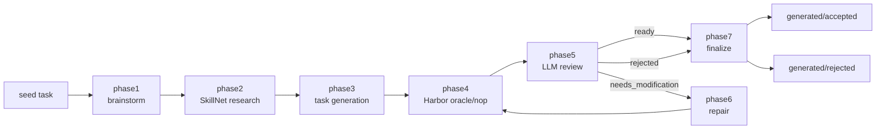

# TB-Harbor-Taskgen

<p align="center">
  <strong>Generate, check, review, repair, and finalize TB3 Harbor tasks from existing seed tasks.</strong>
</p>

<p align="center">
  
  
  
  
  
</p>

<p align="center">
  <strong>English</strong>
  ·
  <a href="README.zh-CN.md">简体中文</a>
</p>

TB-Harbor-Taskgen is a local workflow for turning one read-only Terminal-Bench
Harbor seed task into multiple synthetic TB3 task candidates. The pipeline uses
Claude Code for creative generation and review, injects curated external
knowledge as task-specific Claude Code skills, then gates generated tasks with
Harbor oracle/nop checks before moving them into accepted or rejected outputs.

For implementation details, see the
[developer guide](docs/TB_HARBOR_TASKGEN_MVP_SPEC.md).

## Contents

- [Why This Exists](#why-this-exists)
- [Quick Start](#quick-start)
- [Pipeline](#pipeline)
- [Repository Layout](#repository-layout)
- [Configuration](#configuration)
- [Artifacts](#artifacts)
- [Development](#development)
- [Reference](#reference)

## Why This Exists

High-quality Harbor tasks need more than a prompt and a generated directory.
This project keeps the whole generation trail reproducible:

- Brainstorm several ideas from a seed task.
- Research external SkillNet knowledge and package it as task-specific skills.
- Generate a complete TB3-style Harbor task directory.
- Run formal oracle and nop checks in Harbor.
- Review task quality against TB/Harbor constraints.
- Repair tasks when review finds blocking issues.
- Finalize clean accepted or rejected artifacts.

The stable task id throughout the workflow is:

```text
<seed_id>__<idea_id>
```

The repository does not include seed data. Add seed tasks under
`seeds/<seed_id>/` before running the pipeline, and decide separately whether
those inputs should be committed.

## Quick Start

Install the Python package in editable mode:

```bash
python3 -m pip install -e .
```

If Harbor or SkillNet are not already installed, install the local tool
dependencies with the `uv`-based helper:

```bash
scripts/tool_init.sh
```

Check the available phases:

```bash
scripts/taskgen.sh phases
```

Run the full pipeline for every idea under a seed:

```bash
scripts/taskgen.sh pipeline <seed_id>
```

Run only one idea, allowing up to two automatic repair rounds:

```bash
scripts/taskgen.sh pipeline <seed_id> --idea-id <idea_id> --max-repairs 2
```

Preview what would run without executing anything:

```bash
scripts/taskgen.sh pipeline <seed_id> --idea-id <idea_id> --dry-run
```

Validate a finalized task:

```bash
scripts/taskgen.sh validate phase7 <seed_id> --idea-id <idea_id> --json
```

## Pipeline



| Phase | Purpose | Main Output |
| --- | --- | --- |
| `phase1` | Read one seed and produce 3-5 distinct task ideas with an explicit difficulty profile. | `runs/brainstorm/<seed_id>/seed_brainstorm.json` |
| `phase2` | Research SkillNet and curate per-idea skill packages plus difficulty-hardening guidance. | `runs/skillnet/<seed_id>/` |
| `phase3` | Generate one complete TB3 Harbor task directory. | `generated/working/<seed_id>/<idea_id>/` |
| `phase4` | Run Harbor oracle and nop checks. | `runs/oracle-nop-check/<task_id>/oracle-nop-status.json` |
| `phase5` | Review checked task quality, including too-easy/too-hard calibration, and decide next action. | `runs/reviews/<task_id>/review.json` |
| `phase6` | Repair a task when review returns `needs_modification`, including bounded difficulty repairs. | Updated `generated/working/<seed_id>/<idea_id>/` |
| `phase7` | Move final tasks into accepted or rejected directories. | `generated/accepted/<task_id>/` or `generated/rejected/<task_id>/` |

## Repository Layout

```text
.
├── cc-binary/             # ignored local Claude Code executable path
├── cc-definitions/        # Claude Code agents and reusable generation skill
├── docs/                  # developer guide and project documentation
├── generated/             # working, accepted, and rejected task directories
├── prompts/               # phase prompts rendered into Claude workspaces
├── runs/                  # Claude sessions, checks, reviews, manifests
├── scripts/               # thin shell entry points
├── seeds/                 # read-only input seed tasks
├── src/taskgen/           # Python implementation
├── tests/                 # local unit tests
├── model.json             # Claude model, binary, and per-phase effort config
└── pyproject.toml
```

Shell entry points under `scripts/` source `scripts/env_init.sh` when it exists,
set `PYTHONPATH=src`, and then delegate to the Python package.

## Configuration

`model.json` controls the default Claude Code model, effort levels, and
optionally the Claude Code binary:

```json
{
  "claude_code_path": "cc-binary/claude-2.1.169-linux-x64",
  "default_model": "anthropic/claude-opus-4.8",
  "default_effort": "max",
  "phase_efforts": {
    "phase1": "max",
    "phase2": "medium",
    "phase3": "max",
    "phase5": "high",
    "phase6": "high"
  }
}
```

`claude_code_path` points to the local Claude Code executable under
`cc-binary/`. Keep this relative path aligned with the binary available on the
machine that runs the pipeline. The downloaded executable is not committed.

Supported effort values:

```text
low, medium, high, xhigh, max
```

Create local provider credentials from the example file:

```bash
cp scripts/env_init.example.sh scripts/env_init.sh
```

Then fill `scripts/env_init.sh` locally. Keep real secrets out of committed
documentation and logs.

Phase4 resolves Harbor from `HARBOR_BIN` first, then from `harbor` on `PATH`.

## Artifacts

The most important generated paths are:

```text
generated/working/<seed_id>/<idea_id>/      # task under generation or repair
generated/accepted/<task_id>/               # final accepted task
generated/rejected/<task_id>/               # final rejected task

runs/brainstorm/<seed_id>/                  # phase1 output
runs/skillnet/<seed_id>/                    # phase2 output
runs/oracle-nop-check/<task_id>/            # phase4 Harbor logs and status
runs/reviews/<task_id>/                     # phase5 review JSON and Markdown
runs/claude-sessions/<phase>/<subject>/     # Claude logs and status
runs/workspace/<phase>/<subject>/           # isolated Claude workspaces
runs/task-manifest.jsonl                    # append-only audit manifest
```

Clean intermediate run artifacts with:

```bash
scripts/clean-intermediate.sh --apply
```

## Development

Run local checks before changing pipeline behavior:

```bash
python3 -B -m compileall -q src tests
python3 -B -m unittest discover -s tests -v
bash -n scripts/*.sh
```

Useful inspection commands:

```bash
scripts/taskgen.sh paths <seed_id> --idea-id <idea_id>
scripts/taskgen.sh command phase3 <seed_id> --idea-id <idea_id>
scripts/taskgen.sh validate phase4 <seed_id> --idea-id <idea_id> --json
```

## Reference

- [Developer guide](docs/TB_HARBOR_TASKGEN_MVP_SPEC.md)
- [Task generation prompt](prompts/task-generation.md)
- [Task review prompt](prompts/task-review.md)
- [Task repair prompt](prompts/task-repair.md)
- [TB Harbor generation skill](cc-definitions/skills/tb-harbor-task-generation/SKILL.md)
