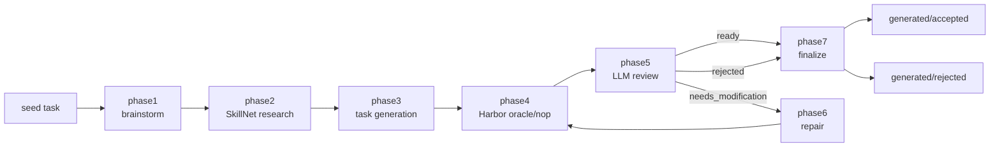

<h1 align="center">TB-Harbor-Taskgen</h1>

<p align="center">
  
</p>

<p align="center">
  <strong>Generate, check, review, repair, and finalize TB3 Harbor tasks from existing seed tasks.</strong>
</p>

<p align="center">
  
  
  
  
  
</p>

<p align="center">
  <strong>English</strong>
  ·
  <a href="README.zh-CN.md">简体中文</a>
</p>

TB-Harbor-Taskgen is a local workflow for turning one read-only Terminal-Bench Harbor seed task into multiple synthetic TB3 task candidates. Claude Code is the agent for generation and review, using either the default Claude backend or an OpenAI-compatible backend through LiteLLM. The pipeline injects curated external knowledge as task-specific Claude Code skills, then gates generated tasks with Harbor oracle/nop checks before moving them into accepted or rejected outputs.

For implementation details, see the [developer guide](docs/TB_HARBOR_TASKGEN_MVP_SPEC.md).

## Contents

- [Why This Exists](#why-this-exists)
- [Quick Start](#quick-start)
- [Pipeline](#pipeline)
- [Repository Layout](#repository-layout)
- [Configuration](#configuration)
- [Artifacts](#artifacts)
- [Development](#development)
- [Reference](#reference)

## Why This Exists

High-quality Harbor tasks need more than a prompt and a generated directory. This project keeps the whole generation trail reproducible:

- Brainstorm several ideas from a seed task.
- Research external SkillNet knowledge and package it as task-specific skills.
- Generate a complete TB3-style Harbor task directory.
- Run formal oracle and nop checks in Harbor.
- Review task quality against TB/Harbor constraints.
- Repair tasks when review finds blocking issues.
- Finalize clean accepted or rejected artifacts.

The stable task id throughout the workflow is:

```text
<seed_id>__<idea_id>
```

IDs use `[A-Za-z0-9._-]+`, cannot contain the reserved `__` separator, and are limited to 128 characters for seeds and 120 for ideas.

The repository does not include seed data. Add seed tasks under `seeds/<seed_id>/` before running the pipeline. Seed contents are ignored by default; committing them requires explicitly overriding or changing that rule.

## Quick Start

Prerequisites are POSIX/Linux, Python 3.10+, Docker, `uv`, and a Claude Code binary. Claude Code remains the agent in both backend modes.

Install the Python package in editable mode:

```bash
python3 -m pip install -e .
```

Install the local Harbor, SkillNet, and LiteLLM tools with the `uv`-based helper:

```bash
scripts/tool_init.sh
```

For authenticated SkillNet downloads in phase2, create the optional local GitHub configuration described under [SkillNet GitHub downloads](#skillnet-github-downloads).

Before the first model-backed run, finish the binary and provider setup under [Configuration](#configuration).

Check the available phases:

```bash
scripts/taskgen.sh phases
```

Run one phase or inspect what follows phase1:

```bash
scripts/taskgen.sh run phase1 <seed_id>
scripts/taskgen.sh next <seed_id>
```

Run the full pipeline for every idea under a seed:

```bash
scripts/taskgen.sh pipeline <seed_id>
```

Request an exact number of brainstorm ideas before downstream processing:

```bash
scripts/taskgen.sh pipeline <seed_id> --idea-count 4
```

Run only one idea, allowing up to two automatic repair rounds:

```bash
scripts/taskgen.sh pipeline <seed_id> --idea-id <idea_id> --max-repairs 2
```

Preview what would run without executing anything:

```bash
scripts/taskgen.sh pipeline <seed_id> --idea-id <idea_id> --dry-run
```

Validate a finalized task:

```bash
scripts/taskgen.sh validate phase7 <seed_id> --idea-id <idea_id> --json
```

To use an OpenAI-compatible backend, complete the [provider setup](#openai-compatible-backend), then add `--openai`:

```bash
scripts/taskgen.sh pipeline <seed_id> --openai
scripts/taskgen.sh run phase1 <seed_id> --openai
```

For model-backed phases, `--model` and `--effort` override `model.json`. Pipeline option `--force` reruns already-valid phases, while `--continue-on-error` continues with later ideas after one fails.

### Command defaults

Without explicit overrides, the current pipeline uses these defaults:

| Setting | Default | Behavior |
| --- | --- | --- |
| Backend (`--openai`) | Off | Use the Claude backend; `--openai` enables the OpenAI-compatible backend. |
| Idea count (`--idea-count`) | Not set | Phase1 requests 3–5 ideas without enforcing an exact count. |
| Idea selection (`--idea-id`) | Not set | `pipeline` processes every phase1 idea sequentially; phases 3–7 require an idea id when run individually. |
| Repair limit (`--max-repairs`) | `2` | Allow up to two phase6 repair rounds per idea. |
| Existing valid phases (`--force`) | Off | Resume from valid outputs; rerun downstream phases when an upstream phase ran. |
| Idea failure (`--continue-on-error`) | Off | Stop the pipeline after the first failed idea. |
| Preview (`--dry-run`) | Off | Execute the selected command instead of only printing it. |
| Model | Claude: `claude-opus-4-8`; OpenAI-compatible: `gpt-5.4` | `--model` overrides the selected backend default. |
| Effort | Claude phases 1/2/3/5/6: `max`/`medium`/`max`/`high`/`high`; OpenAI-compatible: `xhigh` for all five | `--effort` overrides the phase value; phases 4 and 7 do not use Claude Code. |
| Timeout | Claude phases 1/2/5: `1800` seconds; phases 3/6 and each phase4 oracle/nop check: `10800` seconds | Phase-specific values override the global Claude Code timeout. |

Model, effort, binary, and timeout defaults come from the committed [`model.json`](model.json); see [Configuration](#configuration) for the full resolution rules.

## Pipeline



| Phase | Purpose | Main Output |
| --- | --- | --- |
| `phase1` | Read one seed and produce configurable distinct task ideas with an explicit difficulty profile. | `runs/brainstorm/<seed_id>/seed_brainstorm.json` |
| `phase2` | Research SkillNet and curate per-idea skill packages plus difficulty-hardening guidance. | `runs/skillnet/<seed_id>/` |
| `phase3` | Generate one complete TB3 Harbor task directory. | `generated/working/<seed_id>/<idea_id>/` |
| `phase4` | Run Harbor oracle and nop checks. | `runs/oracle-nop-check/<task_id>/oracle-nop-status.json` |
| `phase5` | Review checked task quality, including too-easy/too-hard calibration, and decide next action. | `runs/reviews/<task_id>/review.json` |
| `phase6` | Repair a task when review returns `needs_modification`, including bounded difficulty repairs. | Updated `generated/working/<seed_id>/<idea_id>/` |
| `phase7` | Move final tasks into accepted or rejected directories. | `generated/accepted/<task_id>/` or `generated/rejected/<task_id>/` |

## Repository Layout

```text
.
├── cc-binary/             # ignored local Claude Code executable path
├── cc-definitions/        # Claude Code agents and reusable generation skill
├── docs/                  # developer guide and project documentation
├── generated/             # working, accepted, and rejected task directories
├── prompts/               # phase prompts rendered into Claude workspaces
├── runs/                  # Claude sessions, checks, reviews, manifests
├── scripts/               # thin shell entry points
├── seeds/                 # read-only input seed tasks
├── src/taskgen/           # Python implementation
├── tests/                 # local unit tests
├── model.json             # Claude/OpenAI-compatible model, timeout, and effort config
└── pyproject.toml
```

`scripts/taskgen.sh` loads the selected local provider environment, sets `PYTHONPATH=src`, and delegates to the Python package. The phase2 Claude launcher separately loads its local GitHub download environment when configured.

## Configuration

`model.json` controls the default Claude and OpenAI-compatible model settings, timeouts, effort levels, and optionally the Claude Code binary:

```json
{
  "claude_code_path": "cc-binary/claude-2.1.169-linux-x64",
  "claude_code_timeout_sec": 1800,
  "claude_code_phase_timeouts_sec": {
    "phase3": 10800,
    "phase6": 10800
  },
  "harbor_check_timeout_sec": 10800,
  "default_model": "claude-opus-4-8",
  "default_effort": "max",
  "phase_efforts": {
    "phase1": "max",
    "phase2": "medium",
    "phase3": "max",
    "phase5": "high",
    "phase6": "high"
  },
  "openai": {
    "openai_default_model": "gpt-5.4",
    "openai_default_effort": "xhigh",
    "openai_phase_efforts": {
      "phase1": "xhigh",
      "phase2": "xhigh",
      "phase3": "xhigh",
      "phase5": "xhigh",
      "phase6": "xhigh"
    }
  }
}
```

### Runtime and timeouts

`claude_code_path` points to the local Claude Code executable under `cc-binary/`. Keep this relative path aligned with the binary available on the machine that runs the pipeline. The downloaded executable is not committed.

`claude_code_timeout_sec` is the per-run Claude Code timeout in seconds. It must be positive; the default value `1800` limits each run to 30 minutes. When the limit is reached, the runner terminates that Claude Code process group and records exit code `124` with `timed_out: true` in the session status. Process group cleanup applies to the project's POSIX/Linux runtime.

`claude_code_phase_timeouts_sec` optionally overrides that fallback for named phases. Its keys use the same canonical phase names and aliases as `phase_efforts`, and every value must be a positive finite number. The shipped configuration gives phase3 generation and phase6 repair `10800` seconds (three hours), while all other Claude phases retain the 30-minute global fallback.

`harbor_check_timeout_sec` is the supervisor timeout for each Harbor oracle or nop check. The default `10800` seconds leaves headroom above the generated task's normal two-hour agent limit while preventing a stuck Harbor or Docker process from waiting forever.

The optional early Harbor oracle and nop checks in the phase3 and phase6 prompts honor `HARBOR_BIN` and are each capped at 900 seconds. These checks are best-effort feedback for Claude; phase4 remains the authoritative validation. Phase4 resolves Harbor from `HARBOR_BIN` first, then from `harbor` on `PATH`.

To download the Claude Code binary into a specific directory, change `CLAUDE_BIN_DIR` to the target location:

```bash
CLAUDE_VERSION=2.1.169 CLAUDE_PLATFORM=linux-x64 CLAUDE_BIN_DIR=cc-binary
mkdir -p "$CLAUDE_BIN_DIR" && curl -fsSL "https://downloads.claude.ai/claude-code-releases/${CLAUDE_VERSION}/${CLAUDE_PLATFORM}/claude" -o "$CLAUDE_BIN_DIR/claude-${CLAUDE_VERSION}-${CLAUDE_PLATFORM}" && chmod +x "$CLAUDE_BIN_DIR/claude-${CLAUDE_VERSION}-${CLAUDE_PLATFORM}"
```

If you downloaded the binary to a non-default path, update `claude_code_path` in `model.json` to match. `CLAUDE_PLATFORM` must match the machine that runs the pipeline; common values include `linux-x64`, `linux-arm64`, `linux-x64-musl`, and `linux-arm64-musl`.

### SkillNet GitHub downloads

Phase2 can authenticate its SkillNet downloads against GitHub without exposing the credential to other Claude phases. Create the ignored local file and set a dedicated, least-privilege token:

```bash
cp scripts/github_init.example.sh scripts/github_init.sh
chmod 600 scripts/github_init.sh
```

`scripts/run-claude-logged.sh` loads this file only for `skillnet-research`, with either model backend, so the token is available to that phase's Claude Code process and Bash tools. `GITHUB_TOKEN` raises GitHub API limits and can authorize private repositories; never place its real value in the example, commits, prompts, or logs.

The example also documents an optional raw-content mirror. Leave it unset unless the host is fully trusted: with the pinned SkillNet version, an authenticated download may send the GitHub authorization header to that mirror, and the mirror does not replace GitHub API authentication.

### Claude backend

Without `--openai`, model resolution is `--model` then `default_model`; effort resolution is `--effort`, the matching `phase_efforts` entry, then `default_effort`. The CLI accepts these Claude Code effort values in both backend modes:

```text
low, medium, high, xhigh, max
```

Create local Claude-backend credentials from the example:

```bash
cp scripts/env_init.example.sh scripts/env_init.sh
```

The example targets OpenRouter's Anthropic-compatible endpoint. Set `OPENROUTER_API_KEY`, or adjust its Anthropic environment variables for another provider. Keep real secrets out of committed documentation and logs.

### OpenAI-compatible backend

Create the separate local provider file:

```bash
cp scripts/env_openai_init.example.sh scripts/env_openai_init.sh
```

Set `OPENAI_BASE_URL` to the provider's `/v1` API base and set `OPENAI_API_KEY`. The provider must support `POST /v1/responses` for the current LiteLLM route. Set any model name accepted by that API; it is passed through unchanged to Claude Code's main/default/subagent model settings and LiteLLM's public model name. Both local environment files are ignored by git.

The `openai` values in `model.json` are selected only with `--openai`; whenever the file is loaded, the whole object is validated. Optional `openai_phase_efforts` entries override the OpenAI default by phase; explicit `--model` and `--effort` arguments take precedence. LiteLLM may normalize the selected effort for the model. The gateway does not disable thinking; compatibility depends on the selected model, provider, and LiteLLM translation. Full Claude Code operation requires streaming and tool calling.

A non-dry-run Claude-backed `run ... --openai` starts one temporary loopback LiteLLM proxy. `pipeline --openai` shares one proxy across phases 1, 2, 3, 5, and 6; completion, failure, or interruption stops it. Dry runs do not start the proxy. Only model transport changes: skills, subagents, and permitted Bash tools remain Claude Code features. The project uses LiteLLM's standard Anthropic Messages translation.

`cost.json` still records token usage in this mode, but its dollar total is a Claude Code estimate rather than provider billing.

## Artifacts

The most important generated paths are:

```text
generated/working/<seed_id>/<idea_id>/      # task under generation or repair
generated/accepted/<task_id>/               # final accepted task
generated/rejected/<task_id>/               # final rejected task

runs/brainstorm/<seed_id>/                  # phase1 output
runs/skillnet/<seed_id>/                    # phase2 output
runs/oracle-nop-check/<task_id>/            # phase4 Harbor logs and status
runs/reviews/<task_id>/                     # phase5 review JSON and Markdown
runs/claude-sessions/<phase>/<subject>/<run_id>/ # claude-code.txt, cost.json, status.json
runs/workspace/<phase>/<subject>/<run_id>/  # isolated Claude workspace
runs/task-manifest.jsonl                    # append-only audit manifest
```

Clean intermediate run artifacts with:

```bash
scripts/clean-intermediate.sh --apply
```

Cleanup preserves the append-only `runs/task-manifest.jsonl`; use `--drop-manifest` only when audit history should also be removed. It refuses to run during an active pipeline unless recovery explicitly requires `--force-active`.

Pending recovery journals also block cleanup; `--discard-transactions` is the destructive override. Symlinked containers or ancestors are rejected. If a target itself is a symlink, only the link is removed.

## Development

Run local checks before changing pipeline behavior:

```bash
python3 -B -m compileall -q src tests
python3 -B -m unittest discover -s tests -v
bash -n scripts/*.sh
```

Useful inspection commands:

```bash
scripts/taskgen.sh paths <seed_id> --idea-id <idea_id>
scripts/taskgen.sh command phase3 <seed_id> --idea-id <idea_id>
scripts/taskgen.sh validate phase4 <seed_id> --idea-id <idea_id> --json
```

## Reference

- [Developer guide](docs/TB_HARBOR_TASKGEN_MVP_SPEC.md)
- [Task generation prompt](prompts/task-generation.md)
- [Task review prompt](prompts/task-review.md)
- [Task repair prompt](prompts/task-repair.md)
- [TB Harbor generation skill](cc-definitions/skills/tb-harbor-task-generation/SKILL.md)
