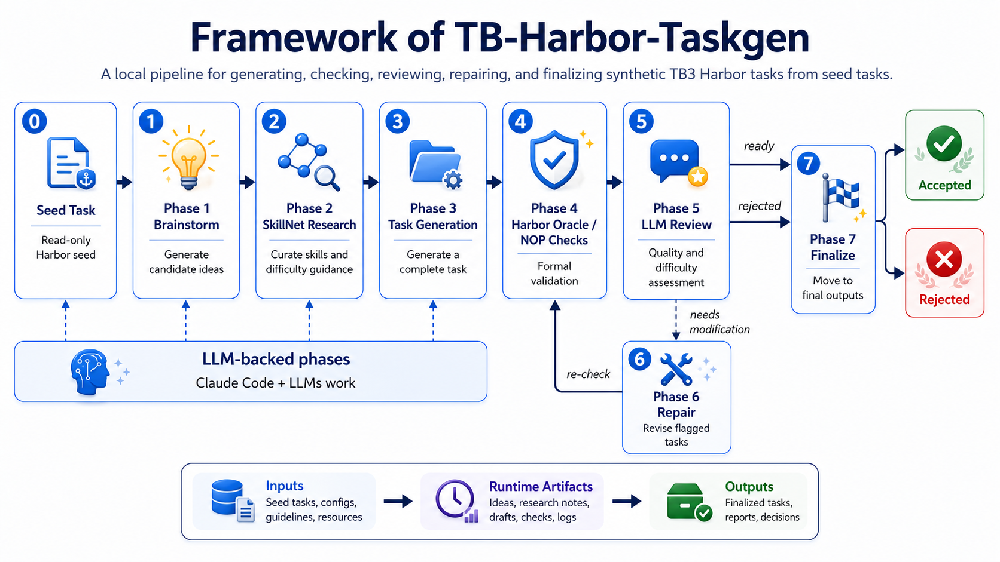
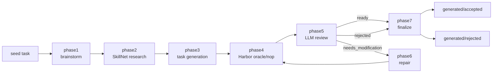

<h1 align="center">TB-Harbor-Taskgen</h1>

<p align="center">
  
</p>

<p align="center">
  <strong>从已有 seed task 出发，生成、检查、评审、修复并整理 TB3 Harbor 任务。</strong>
</p>

<p align="center">
  
  
  
  
  
</p>

<p align="center">
  <a href="README.md">English</a>
  ·
  <strong>简体中文</strong>
</p>

TB-Harbor-Taskgen 是一个本地任务生成流水线。它从一个只读 Terminal-Bench Harbor seed task 出发，生成多个合成的 TB3 task candidates。流水线使用 Claude Code 完成创意生成和评审，把外部知识整理成 task-specific Claude Code skills 注入生成 workspace，再通过 Harbor oracle/nop 检查作为动态 gate，最后把任务整理到 accepted 或 rejected 产物目录。

实现细节见 [开发者指南](docs/TB_HARBOR_TASKGEN_MVP_SPEC.zh-CN.md)。

## 目录

- [为什么需要它](#为什么需要它)
- [快速开始](#快速开始)
- [流水线](#流水线)
- [仓库结构](#仓库结构)
- [配置](#配置)
- [产物](#产物)
- [开发](#开发)
- [参考](#参考)

## 为什么需要它

高质量 Harbor task 不能只靠一个 prompt 和一个生成目录。本项目把完整生成轨迹保留下来：

- 从 seed task 头脑风暴多个不同 task ideas。
- 检索 SkillNet 外部知识，并把它们封装为 task-specific skills。
- 生成完整 TB3 风格 Harbor task directory。
- 在 Harbor 中运行正式 oracle/nop 检查。
- 按 TB/Harbor 约束评审任务质量。
- 对 review 发现的问题执行修复。
- 最终整理为干净的 accepted 或 rejected artifacts。

流水线中的稳定 task id 是：

```text
<seed_id>__<idea_id>
```

仓库当前不包含 seed 数据。运行流水线前，请先把 seed task 放到
`seeds/<seed_id>/`，并按项目需要决定这些输入是否提交。

## 快速开始

以 editable 模式安装 Python package：

```bash
python3 -m pip install -e .
```

如果本机还没有安装 Harbor 或 SkillNet，可以使用基于 `uv` 的 helper 安装本地工具依赖：

```bash
scripts/tool_init.sh
```

查看可用 phases：

```bash
scripts/taskgen.sh phases
```

对一个 seed 的所有 ideas 运行完整流水线：

```bash
scripts/taskgen.sh pipeline <seed_id>
```

只运行一个 idea，并允许最多两轮自动 repair：

```bash
scripts/taskgen.sh pipeline <seed_id> --idea-id <idea_id> --max-repairs 2
```

只预览将要执行的命令，不实际运行：

```bash
scripts/taskgen.sh pipeline <seed_id> --idea-id <idea_id> --dry-run
```

验证一个 finalized task：

```bash
scripts/taskgen.sh validate phase7 <seed_id> --idea-id <idea_id> --json
```

## 流水线



| Phase | 作用 | 主要输出 |
| --- | --- | --- |
| `phase1` | 读取一个 seed，生成 3-5 个带显式难度 profile 的 task ideas。 | `runs/brainstorm/<seed_id>/seed_brainstorm.json` |
| `phase2` | 检索 SkillNet，并为每个 idea 整理 skill packages 和 difficulty-hardening 指导。 | `runs/skillnet/<seed_id>/` |
| `phase3` | 为一个 idea 生成完整 TB3 Harbor task directory。 | `generated/working/<seed_id>/<idea_id>/` |
| `phase4` | 运行 Harbor oracle 和 nop 检查。 | `runs/oracle-nop-check/<task_id>/oracle-nop-status.json` |
| `phase5` | 评审 checked task 的质量，包括过易/过难校准，并决定下一步。 | `runs/reviews/<task_id>/review.json` |
| `phase6` | 当 review 返回 `needs_modification` 时修复任务，包括有界难度修复。 | 更新后的 `generated/working/<seed_id>/<idea_id>/` |
| `phase7` | 将最终任务移动到 accepted 或 rejected 目录。 | `generated/accepted/<task_id>/` 或 `generated/rejected/<task_id>/` |

## 仓库结构

```text
.
├── cc-binary/             # model.json 引用的本地 Claude Code 可执行文件路径
├── cc-definitions/        # Claude Code agents 和 reusable generation skill
├── docs/                  # 开发者指南和项目文档
├── generated/             # working、accepted、rejected task directories
├── prompts/               # 渲染到 Claude workspaces 的 phase prompts
├── runs/                  # Claude sessions、checks、reviews、manifests
├── scripts/               # 轻量 shell entry points
├── seeds/                 # 只读输入 seed tasks
├── src/taskgen/           # Python 实现
├── tests/                 # 本地单元测试
├── model.json             # Claude model、binary 和 per-phase effort config
└── pyproject.toml
```

`scripts/` 下的 shell entry points 会在存在时 source `scripts/env_init.sh`，设置 `PYTHONPATH=src`，然后转发到 Python package。

## 配置

`model.json` 控制默认 Claude Code model、effort levels，并可选地指定
Claude Code binary：

```json
{
  "claude_code_path": "cc-binary/claude-2.1.169-linux-x64",
  "default_model": "anthropic/claude-opus-4.8",
  "default_effort": "max",
  "phase_efforts": {
    "phase1": "max",
    "phase2": "medium",
    "phase3": "max",
    "phase5": "high",
    "phase6": "high"
  }
}
```

`claude_code_path` 指向 `cc-binary/` 下的本地 Claude Code 可执行文件。请保持这个相对路径与运行机器上的实际 binary 一致；下载的可执行文件不提交到仓库。

支持的 effort values：

```text
low, medium, high, xhigh, max
```

从 example 文件创建本地 provider credentials：

```bash
cp scripts/env_init.example.sh scripts/env_init.sh
```

然后只在本机填写 `scripts/env_init.sh`。不要把真实 secrets 写入提交文档或日志。

Phase4 会先从 `HARBOR_BIN` 解析 Harbor，再回退到 `PATH` 上的 `harbor`。

## 产物

最重要的生成路径：

```text
generated/working/<seed_id>/<idea_id>/      # 生成中或修复中的任务
generated/accepted/<task_id>/               # 最终 accepted task
generated/rejected/<task_id>/               # 最终 rejected task

runs/brainstorm/<seed_id>/                  # phase1 output
runs/skillnet/<seed_id>/                    # phase2 output
runs/oracle-nop-check/<task_id>/            # phase4 Harbor logs and status
runs/reviews/<task_id>/                     # phase5 review JSON and Markdown
runs/claude-sessions/<phase>/<subject>/     # Claude logs and status
runs/workspace/<phase>/<subject>/           # isolated Claude workspaces
runs/task-manifest.jsonl                    # append-only audit manifest
```

清理中间运行产物：

```bash
scripts/clean-intermediate.sh --apply
```

## 开发

修改流水线行为前运行本地检查：

```bash
python3 -B -m compileall -q src tests
python3 -B -m unittest discover -s tests -v
bash -n scripts/*.sh
```

常用检查命令：

```bash
scripts/taskgen.sh paths <seed_id> --idea-id <idea_id>
scripts/taskgen.sh command phase3 <seed_id> --idea-id <idea_id>
scripts/taskgen.sh validate phase4 <seed_id> --idea-id <idea_id> --json
```

## 参考

- [开发者指南](docs/TB_HARBOR_TASKGEN_MVP_SPEC.zh-CN.md)
- [Task generation prompt](prompts/task-generation.md)
- [Task review prompt](prompts/task-review.md)
- [Task repair prompt](prompts/task-repair.md)
- [TB Harbor generation skill](cc-definitions/skills/tb-harbor-task-generation/SKILL.md)
