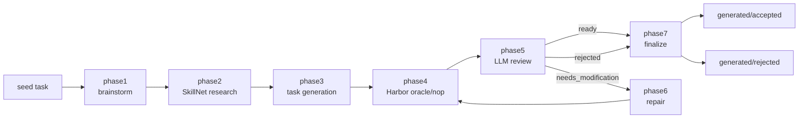

<h1 align="center">TB-Harbor-Taskgen</h1>

<p align="center">
  
</p>

<p align="center">
  <strong>从已有 seed task 出发，生成、检查、评审、修复并整理 TB3 Harbor 任务。</strong>
</p>

<p align="center">
  
  
  
  
  
</p>

<p align="center">
  <a href="README.md">English</a>
  ·
  <strong>简体中文</strong>
</p>

TB-Harbor-Taskgen 是一个从只读 Terminal-Bench Harbor seed task 生成 TB3 task candidates 的本地流水线。Claude Code 负责生成和评审，既可以使用默认 Claude 后端，也可以通过 LiteLLM 连接 OpenAI-compatible 后端。流水线把外部知识整理成 task-specific Claude Code skills 注入 workspace，再通过 Harbor oracle/nop 检查筛选任务，最后整理到 accepted 或 rejected 产物目录。

实现细节见 [开发者指南](docs/TB_HARBOR_TASKGEN_MVP_SPEC.zh-CN.md)。

## 目录

- [为什么需要它](#为什么需要它)
- [快速开始](#快速开始)
- [流水线](#流水线)
- [仓库结构](#仓库结构)
- [配置](#配置)
- [产物](#产物)
- [开发](#开发)
- [参考](#参考)

## 为什么需要它

高质量 Harbor task 不能只靠一个 prompt 和一个生成目录。本项目把完整生成轨迹保留下来：

- 从 seed task 头脑风暴多个不同 task ideas。
- 检索 SkillNet 外部知识，并把它们封装为 task-specific skills。
- 生成完整 TB3 风格 Harbor task directory。
- 在 Harbor 中运行正式 oracle/nop 检查。
- 按 TB/Harbor 约束评审任务质量。
- 对 review 发现的问题执行修复。
- 最终整理为干净的 accepted 或 rejected artifacts。

流水线中的稳定 task id 是：

```text
<seed_id>__<idea_id>
```

ID 使用 `[A-Za-z0-9._-]+`，不能包含保留分隔符 `__`；seed 最长 128 个字符，idea 最长 120 个字符。

仓库当前不包含 seed 数据。运行流水线前，请先把 seed task 放到 `seeds/<seed_id>/`。Seed 内容默认被 git 忽略；如需提交，必须显式覆盖或调整该 ignore 规则。

## 快速开始

前置条件是 POSIX/Linux、Python 3.10+、Docker、`uv` 和 Claude Code binary。两种后端模式都继续使用 Claude Code 作为 agent。

以 editable 模式安装 Python package：

```bash
python3 -m pip install -e .
```

使用基于 `uv` 的 helper 安装本地 Harbor、SkillNet 和 LiteLLM 工具：

```bash
scripts/tool_init.sh
```

如需在 phase2 中进行认证的 SkillNet 下载，请按 [SkillNet GitHub 下载](#skillnet-github-下载)创建可选的本地 GitHub 配置。

首次运行模型 phase 前，先完成[配置](#配置)中的 binary 和 provider 设置。

查看可用 phases：

```bash
scripts/taskgen.sh phases
```

运行单个 phase，或查看 phase1 完成后的下一步：

```bash
scripts/taskgen.sh run phase1 <seed_id>
scripts/taskgen.sh next <seed_id>
```

对一个 seed 的所有 ideas 运行完整流水线：

```bash
scripts/taskgen.sh pipeline <seed_id>
```

在进入后续阶段前指定 phase1 需要生成的 idea 数量：

```bash
scripts/taskgen.sh pipeline <seed_id> --idea-count 4
```

只运行一个 idea，并允许最多两轮自动 repair：

```bash
scripts/taskgen.sh pipeline <seed_id> --idea-id <idea_id> --max-repairs 2
```

只预览将要执行的命令，不实际运行：

```bash
scripts/taskgen.sh pipeline <seed_id> --idea-id <idea_id> --dry-run
```

验证一个 finalized task：

```bash
scripts/taskgen.sh validate phase7 <seed_id> --idea-id <idea_id> --json
```

如需使用 OpenAI-compatible 后端，先完成[后端配置](#openai-compatible-后端)，再加入 `--openai`：

```bash
scripts/taskgen.sh pipeline <seed_id> --openai
scripts/taskgen.sh run phase1 <seed_id> --openai
```

对于模型 phase，`--model` 和 `--effort` 会覆盖 `model.json`。Pipeline 的 `--force` 会重跑已通过验证的 phase，`--continue-on-error` 会在一个 idea 失败后继续处理后续 ideas。

## 流水线



| Phase | 作用 | 主要输出 |
| --- | --- | --- |
| `phase1` | 读取一个 seed，生成可配置数量的带显式难度 profile 的 task ideas。 | `runs/brainstorm/<seed_id>/seed_brainstorm.json` |
| `phase2` | 检索 SkillNet，并为每个 idea 整理 skill packages 和 difficulty-hardening 指导。 | `runs/skillnet/<seed_id>/` |
| `phase3` | 为一个 idea 生成完整 TB3 Harbor task directory。 | `generated/working/<seed_id>/<idea_id>/` |
| `phase4` | 运行 Harbor oracle 和 nop 检查。 | `runs/oracle-nop-check/<task_id>/oracle-nop-status.json` |
| `phase5` | 评审 checked task 的质量，包括过易/过难校准，并决定下一步。 | `runs/reviews/<task_id>/review.json` |
| `phase6` | 当 review 返回 `needs_modification` 时修复任务，包括有界难度修复。 | 更新后的 `generated/working/<seed_id>/<idea_id>/` |
| `phase7` | 将最终任务移动到 accepted 或 rejected 目录。 | `generated/accepted/<task_id>/` 或 `generated/rejected/<task_id>/` |

## 仓库结构

```text
.
├── cc-binary/             # model.json 引用的本地 Claude Code 可执行文件路径
├── cc-definitions/        # Claude Code agents 和 reusable generation skill
├── docs/                  # 开发者指南和项目文档
├── generated/             # working、accepted、rejected task directories
├── prompts/               # 渲染到 Claude workspaces 的 phase prompts
├── runs/                  # Claude sessions、checks、reviews、manifests
├── scripts/               # 轻量 shell entry points
├── seeds/                 # 只读输入 seed tasks
├── src/taskgen/           # Python 实现
├── tests/                 # 本地单元测试
├── model.json             # Claude/OpenAI-compatible model、timeout 和 effort config
└── pyproject.toml
```

`scripts/taskgen.sh` 会加载所选后端的本地环境、设置 `PYTHONPATH=src`，再转发到 Python package。phase2 的 Claude launcher 会在配置存在时单独加载本地 GitHub 下载环境。

## 配置

`model.json` 控制默认 Claude 和 OpenAI-compatible model 配置、timeout、effort levels，并可选地指定 Claude Code binary：

```json
{
  "claude_code_path": "cc-binary/claude-2.1.169-linux-x64",
  "claude_code_timeout_sec": 1800,
  "claude_code_phase_timeouts_sec": {
    "phase3": 10800,
    "phase6": 10800
  },
  "harbor_check_timeout_sec": 10800,
  "default_model": "claude-opus-4-8",
  "default_effort": "max",
  "phase_efforts": {
    "phase1": "max",
    "phase2": "medium",
    "phase3": "max",
    "phase5": "high",
    "phase6": "high"
  },
  "openai": {
    "openai_default_model": "gpt-5.4",
    "openai_default_effort": "xhigh",
    "openai_phase_efforts": {
      "phase1": "xhigh",
      "phase2": "xhigh",
      "phase3": "xhigh",
      "phase5": "xhigh",
      "phase6": "xhigh"
    }
  }
}
```

### 运行时和超时

`claude_code_path` 指向 `cc-binary/` 下的本地 Claude Code 可执行文件。请保持这个相对路径与运行机器上的实际 binary 一致；下载的可执行文件不提交到仓库。

`claude_code_timeout_sec` 是每次 Claude Code 运行的超时时间，单位为秒，且必须为正数。默认值 `1800` 表示 30 分钟；达到该时限后，runner 会在项目使用的 POSIX/Linux 运行环境中终止本次 Claude Code 的整个进程组，并在 session status 中记录退出码 `124` 和 `timed_out: true`。

`claude_code_phase_timeouts_sec` 可按 phase 覆盖上述兜底值。key 与 `phase_efforts` 使用相同的 canonical phase name 和 alias，每个值都必须是正有限数。仓库配置把 phase3 生成和 phase6 修复设为 `10800` 秒（3 小时），其他 Claude phase 仍使用全局 30 分钟兜底值。

`harbor_check_timeout_sec` 是每次 Harbor oracle 或 nop 检查的外层超时时间。默认值 `10800` 秒高于生成任务通常使用的两小时 agent 时限，同时避免 Harbor、Docker 或其子进程永久挂起。

phase3 和 phase6 提示词中的可选早期 Harbor oracle/nop 检查会使用 `HARBOR_BIN`，并且每次最多运行 900 秒。这些检查只为 Claude 提供尽早反馈，phase4 仍是正式验证。

Phase4 会先从 `HARBOR_BIN` 解析 Harbor，再回退到 `PATH` 上的 `harbor`。

如果需要把 Claude Code binary 下载到指定目录，可以把 `CLAUDE_BIN_DIR` 改成目标目录：

```bash
CLAUDE_VERSION=2.1.169 CLAUDE_PLATFORM=linux-x64 CLAUDE_BIN_DIR=cc-binary
mkdir -p "$CLAUDE_BIN_DIR" && curl -fsSL "https://downloads.claude.ai/claude-code-releases/${CLAUDE_VERSION}/${CLAUDE_PLATFORM}/claude" -o "$CLAUDE_BIN_DIR/claude-${CLAUDE_VERSION}-${CLAUDE_PLATFORM}" && chmod +x "$CLAUDE_BIN_DIR/claude-${CLAUDE_VERSION}-${CLAUDE_PLATFORM}"
```

如果下载到了非默认路径，请同步更新 `model.json` 里的 `claude_code_path`。`CLAUDE_PLATFORM` 需要和运行机器一致；常见值包括 `linux-x64`、`linux-arm64`、`linux-x64-musl` 和 `linux-arm64-musl`。

### SkillNet GitHub 下载

Phase2 可以为 SkillNet 下载提供 GitHub 认证，同时不把凭据传入其他 Claude Code phases。创建被忽略的本地文件，并填写专用、最小权限的 Token：

```bash
cp scripts/github_init.example.sh scripts/github_init.sh
chmod 600 scripts/github_init.sh
```

无论使用哪种模型后端，`scripts/run-claude-logged.sh` 都只会在 `skillnet-research` 阶段加载该文件，因此 Token 会提供给该阶段的 Claude Code 进程及其 Bash 工具。`GITHUB_TOKEN` 可提高 GitHub API 限额并访问私有仓库；不要把真实值写入 example、commit、prompt 或日志。

example 还说明了可选的 raw-content mirror。除非完全信任镜像主机，否则应保持未设置：当前固定的 SkillNet 版本在认证下载时可能把 GitHub Authorization header 发送给镜像，而且镜像不能代替 GitHub API 认证。

### Claude 后端

未传入 `--openai` 时，模型依次从 `--model`、`default_model` 解析；effort 依次从 `--effort`、匹配的 `phase_efforts` 和 `default_effort` 解析。两种后端模式的 CLI 都接受以下 Claude Code effort values：

```text
low, medium, high, xhigh, max
```

从 example 创建 Claude 后端的本地 credentials：

```bash
cp scripts/env_init.example.sh scripts/env_init.sh
```

该 example 默认连接 OpenRouter 的 Anthropic-compatible endpoint。设置 `OPENROUTER_API_KEY`；如使用其他 provider，则调整其中的 Anthropic 环境变量。不要把真实 secrets 写入提交文档或日志。

### OpenAI-compatible 后端

创建单独的本地 provider 文件：

```bash
cp scripts/env_openai_init.example.sh scripts/env_openai_init.sh
```

将 `OPENAI_BASE_URL` 设为 provider 的 `/v1` API base，并填写 `OPENAI_API_KEY`。当前 LiteLLM 路径要求 provider 支持 `POST /v1/responses`。模型可使用该 API 接受的任意名称，并会原样用于 Claude Code 的主模型、默认模型、subagent 模型和 LiteLLM 公开模型名。两个本地环境文件都会被 git 忽略。

`model.json` 中的 `openai` 值只在传入 `--openai` 时选用；每次加载该文件时，整个对象都会被校验。可选的 `openai_phase_efforts` 可以按 phase 覆盖默认值，显式 `--model` 和 `--effort` 的优先级更高。LiteLLM 可能按模型能力调整 effort 档位。网关不会主动禁用 thinking；兼容性取决于所选模型、provider 和 LiteLLM 转换。完整运行 Claude Code 要求上游支持 streaming 和 tool calling。

非 dry-run 的 Claude-backed `run ... --openai` 会启动一个临时回环 LiteLLM proxy。`pipeline --openai` 在 phase1、phase2、phase3、phase5 和 phase6 间复用一个 proxy，正常结束、失败或中断时都会停止；dry-run 不会启动 proxy。该模式只改变模型传输链路，skills、subagents 和允许的 Bash 工具仍是 Claude Code 的能力。项目使用 LiteLLM 标准的 Anthropic Messages 转换。

该模式仍会在 `cost.json` 中记录 token usage，但金额是 Claude Code 的估算值，不是 provider 账单。

## 产物

最重要的生成路径：

```text
generated/working/<seed_id>/<idea_id>/      # 生成中或修复中的任务
generated/accepted/<task_id>/               # 最终 accepted task
generated/rejected/<task_id>/               # 最终 rejected task

runs/brainstorm/<seed_id>/                  # phase1 output
runs/skillnet/<seed_id>/                    # phase2 output
runs/oracle-nop-check/<task_id>/            # phase4 Harbor logs and status
runs/reviews/<task_id>/                     # phase5 review JSON and Markdown
runs/claude-sessions/<phase>/<subject>/<run_id>/ # claude-code.txt、cost.json、status.json
runs/workspace/<phase>/<subject>/<run_id>/  # isolated Claude workspace
runs/task-manifest.jsonl                    # append-only audit manifest
```

清理中间运行产物：

```bash
scripts/clean-intermediate.sh --apply
```

清理命令默认保留 append-only 的 `runs/task-manifest.jsonl`；仅在确实需要删除审计历史时使用 `--drop-manifest`。检测到活跃流水线时会拒绝执行，`--force-active` 只应用于故障恢复。

待恢复的事务日志也会阻止清理；`--discard-transactions` 是破坏性覆盖。命令会拒绝 symlink container 或带 symlink ancestor 的目标；若目标本身是 symlink，则只删除该链接。

## 开发

修改流水线行为前运行本地检查：

```bash
python3 -B -m compileall -q src tests
python3 -B -m unittest discover -s tests -v
bash -n scripts/*.sh
```

常用检查命令：

```bash
scripts/taskgen.sh paths <seed_id> --idea-id <idea_id>
scripts/taskgen.sh command phase3 <seed_id> --idea-id <idea_id>
scripts/taskgen.sh validate phase4 <seed_id> --idea-id <idea_id> --json
```

## 参考

- [开发者指南](docs/TB_HARBOR_TASKGEN_MVP_SPEC.zh-CN.md)
- [Task generation prompt](prompts/task-generation.md)
- [Task review prompt](prompts/task-review.md)
- [Task repair prompt](prompts/task-repair.md)
- [TB Harbor generation skill](cc-definitions/skills/tb-harbor-task-generation/SKILL.md)
